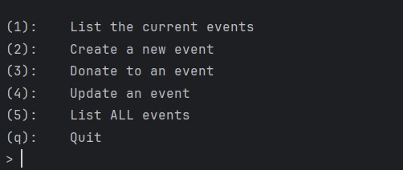
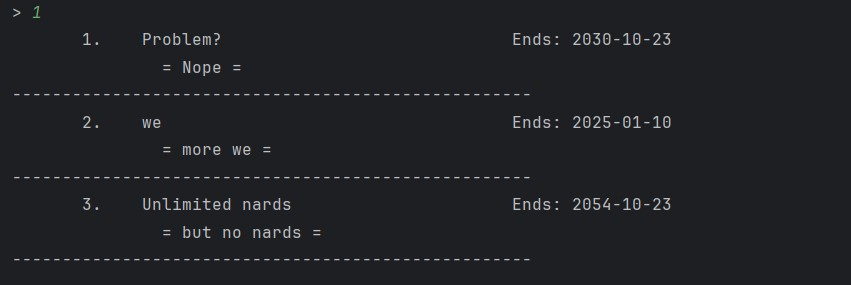
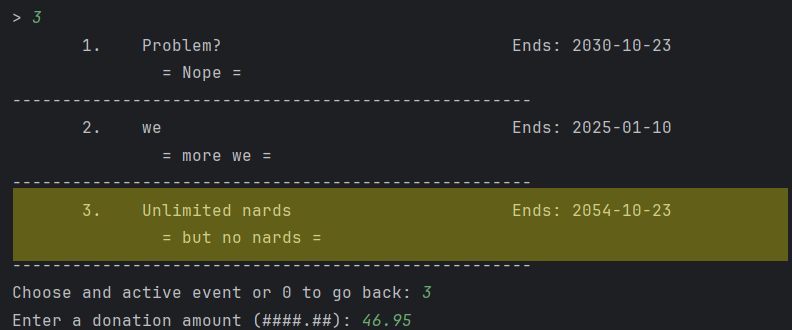
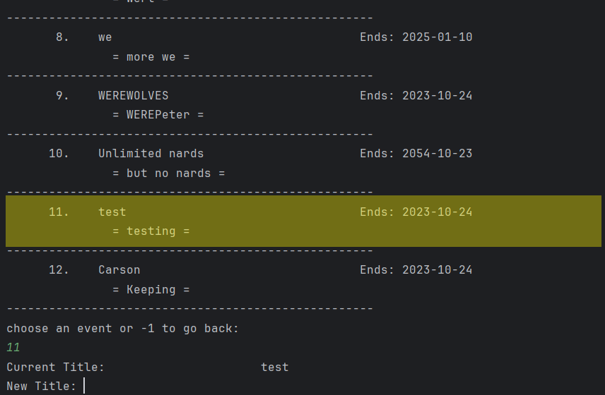

# <ins>User Manual</ins>
## *Server-side Program*

### Press Play

That's right! Start the executable and give your clients your
IP that will show in your terminal.

### Logging

Standard logs will be in white and errors will appear in red.
Errors will be logged in the server and sent to the client.

### Request Response Model

The Server Client pair uses an in-house communication method
that passes serialized request and response objects to each other.
This helps protect data and makes error handling easy.

### Database

The database used for the server of this project is SQLlite which when opened up looks like this:

The SQLlite Database

## *Client-side Program*

### How to run the Client side:

1. Run Client.java using preferred method, Easiest is to press the run button in the top right

2. Enter the server computer's IP address when prompted

3. Enter the port number when prompted (our project uses 6789)

4. Enter the Option you want to use from the Option list (more information in the Options section)

5. Follow the Prompts as listed

Client Prompts

### Options

1.  List current events

    a. Enter 1 at the Options prompt

    b. The current/active events will be listed out

List of current Events

2. Create a new Event

   a. Enter 2 at the Options prompt

   b. Enter the Title for your event

   c. Enter the Description for your event

   d. Enter the Target amount for your event in the form ####.00

   e. Enter the Deadline of your event in the form YYYY-MM-DDTHH:MM:SSSZ

         e.g. Oct 25, 2023 at 1:45:30PM would be 2023-10-25T13:45:300Z

3.  Donate to a current event

    a. Enter 3 at the Options prompt

    b. Enter the number of the event you wish to donate to

    c. Enter the amount you wish to donate in the form ####.00

Selecting an Event to Donate to

4.  Update an event

    a. Enter 4 at the Options prompt

    b. Enter the number of the event you wish to update

    c. Enter the new title of the event or leave blank to keep the current

    d. Enter the new description of the event or leave blank to keep the current

    e. Enter the new target of the event or leave blank to keep the current

    f. Enter the new balance of the event or leave blank to keep the current

Selecting an Event to Update

5.  List all events

    a. Enter 5 at the Options prompt

    b. The current and past events will be listed out

Listing of All Events in a Table format

6.  Quit Client-side

    a. Enter q at the Options prompt

    b. The program will end

